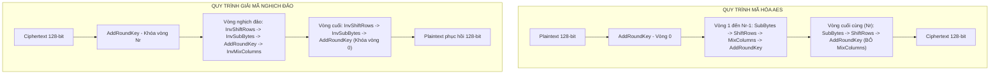
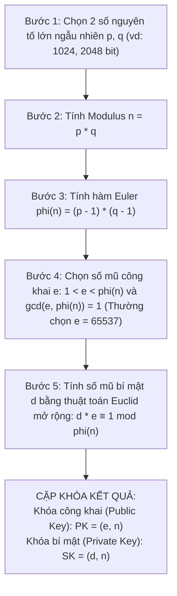
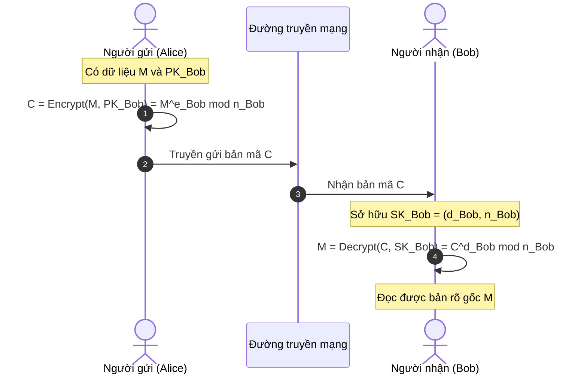
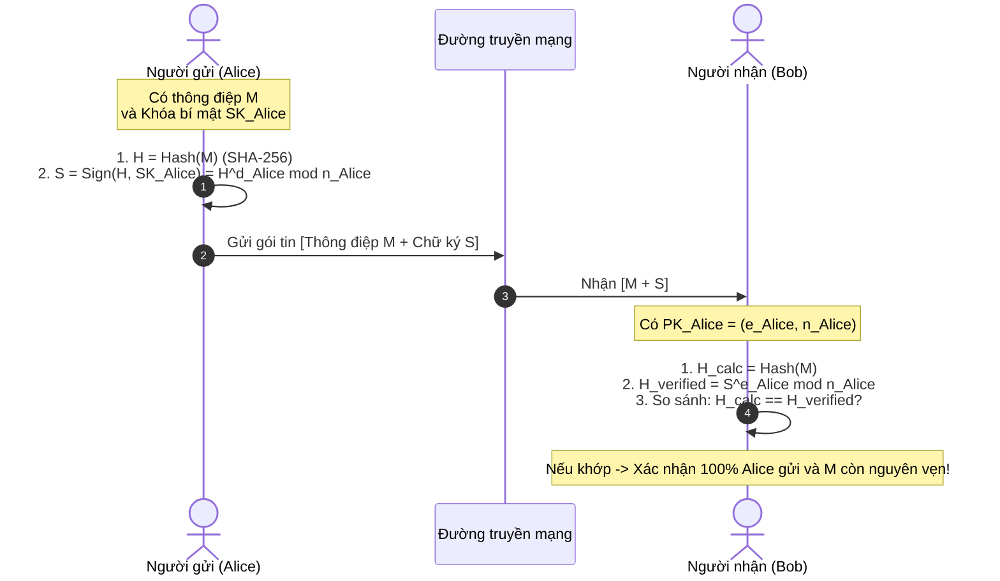
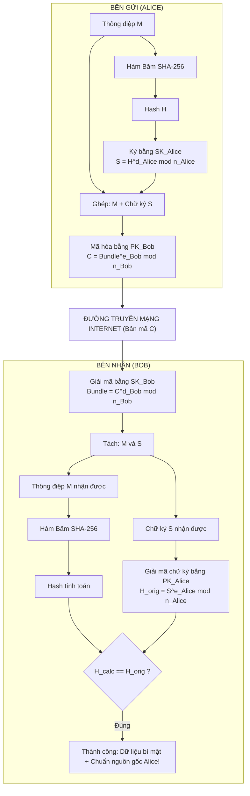

# BÁO CÁO KỸ THUẬT: CƠ SỞ MẬT MÃ HỌC HIỆN ĐẠI (DES, AES, RSA VÀ MÃ HÓA LAI)

**Môn học:** An Toàn và Bảo Mật Thông Tin  
**Chủ đề:** Nghiên cứu lý thuyết và ứng dụng các thuật toán mã hóa khối đối xứng (DES, AES), mã hóa bất đối xứng (RSA), so sánh hiệu năng và kiến trúc mã hóa lai (Hybrid Cryptosystem).

---

## MỤC LỤC

1. [Khái Quát Thuật Toán Mã Hóa Hiện Đại DES và AES](#1-khái-quát-thuật-toán-mã-hóa-hiện-đại-des-và-aes)
   - 1.1. Chuẩn mã hóa dữ liệu DES (Data Encryption Standard)
   - 1.2. Chuẩn mã hóa nâng cao AES (Advanced Encryption Standard - Rijndael)
   - 1.3. Bốn phép biến đổi cốt lõi trong mỗi vòng AES
   - 1.4. Quy trình mã hóa và giải mã toàn diện của AES
2. [Thuật Toán Mã Hóa Bất Đối Xứng RSA](#2-thuật-toán-mã-hóa-bất-đối-xứng-rsa)
   - 2.1. Nền tảng số học và lý thuyết độ phức tạp
   - 2.2. Các bước sinh cặp khóa (Key Generation) chi tiết
   - 2.3. Quy trình mã hóa và giải mã RSA
   - 2.4. Ví dụ minh họa từng bước bằng số học cụ thể
3. [Các Mô Hình Ứng Dụng Thuật Toán RSA](#3-các-mô-hình-ứng-dụng-thuật-toán-rsa)
   - 3.1. Mô hình 1: Bảo mật dữ liệu cho người nhận (Confidentiality)
   - 3.2. Mô hình 2: Xác thực nguồn gốc và chữ ký số (Authentication & Integrity)
   - 3.3. Mô hình 3: Kết hợp Bảo mật và Xác thực (Dual-protection)
4. [So Sánh Hiệu Năng Tính Toán: RSA Đối Đầu AES](#4-so-sánh-hiệu-năng-tính-toán-rsa-đối-đầu-aes)
   - 4.1. Phân tích bản chất phép toán vi xử lý
   - 4.2. Bảng so sánh chỉ số định lượng toàn diện
   - 4.3. Đánh giá kích thước khóa an toàn tương đương
5. [Cơ Chế Mã Hóa Lai (Hybrid Encryption)](#5-cơ-chế-mã-hóa-lai-hybrid-encryption)
   - 5.1. Động lực kiến trúc: Hóa giải bài toán trao đổi khóa và tốc độ
   - 5.2. Quy trình đóng gói và giải phóng dữ liệu (Digital Envelope)
   - 5.3. Ứng dụng thực tiễn trong các giao thức bảo mật Internet
6. [Kết Luận](#6-kết-luận)

---

## 1. KHÁI QUÁT THUẬT TOÁN MÃ HÓA HIỆN ĐẠI DES VÀ AES

Mã hóa đối xứng (Symmetric Encryption) là nền tảng cốt lõi của an ninh thông tin, sử dụng cùng một khóa bí mật $K$ cho cả hai tiến trình mã hóa và giải mã. Hai thuật toán tiêu biểu đại diện cho hai thời kỳ phát triển của mật mã hiện đại là DES và AES.

```
       Bản rõ (Plaintext P) ───────┐
                                  ▼
      Khóa bí mật (Key K) ──► [ Bộ Mã Hóa Đối Xứng ] ──► Bản mã (Ciphertext C)
                                  │
                                  ▼
      Khóa bí mật (Key K) ──► [ Bộ Giải Mã Đối Xứng ] ──► Bản rõ (Plaintext P)
```

---

### 1.1. Chuẩn mã hóa dữ liệu DES (Data Encryption Standard)

- **Lịch sử hình thành:** Được phát triển bởi IBM (dựa trên thuật toán Lucifer) và được Viện Tiêu chuẩn và Công nghệ Quốc gia Hoa Kỳ (NIST / khi đó là NBS) chuẩn hóa vào năm 1977.
- **Cấu trúc mạng Feistel:**
  - Kích thước khối dữ liệu (Block size): **64 bit**.
  - Độ dài khóa (Key length): Khóa trên danh nghĩa là **64 bit**, nhưng 8 bit được dùng làm bit chẵn lẻ (parity check), do đó độ dài khóa thực tế chỉ là **56 bit**.
  - Số vòng lặp: **16 vòng (rounds)** với cấu trúc Feistel đối xứng.
- **Quy trình xử lý của DES:**
  1. *Hoán vị khởi đầu (Initial Permutation - IP):* Xáo trộn vị trí 64 bit của khối đầu vào.
  2. *Tách đôi khối:* Chia thành hai nửa trái và phải $L_0$ và $R_0$, mỗi nửa 32 bit.
  3. *16 vòng lặp Feistel:* Tại vòng thứ $i$ ($1 \le i \le 16$), sử dụng khóa con $K_i$ (48 bit sinh ra từ bộ Key Schedule):
     $$L_i = R_{i-1}$$
     $$R_i = L_{i-1} \oplus F(R_{i-1}, K_i)$$
     Trong đó, hàm vòng $F(R, K)$ gồm 4 bước:
     - **Mở rộng (Expansion E):** Mở rộng 32 bit lên 48 bit bằng cách nhân bản một số bit.
     - **Cộng khóa con:** XOR 48 bit với khóa con $K_i$ ($E(R) \oplus K_i$).
     - **Hộp thế (S-Boxes):** 48 bit được chia thành 8 nhóm 6-bit đưa vào 8 hộp S-box phi tuyến, mỗi hộp cho ra 4 bit (tổng cộng $8 \times 4 = 32$ bit). Đây là bước phi tuyến duy nhất tạo nên tính an toàn của DES.
     - **Hoán vị (Permutation P):** Đảo vị trí 32 bit đầu ra của S-box để khuếch tán.
  4. *Đổi chỗ 2 nửa (32-bit Swap):* Ghép $R_{16}$ và $L_{16}$.
  5. *Hoán vị nghịch đảo (Final Permutation - $IP^{-1}$):* Đảo ngược bước IP ban đầu cho ra 64 bit bản mã.
- **Điểm yếu cốt tử:** Không gian khóa $2^{56} \approx 7.2 \times 10^{16}$ khóa quá nhỏ so với năng lực tính toán hiện đại. Vào năm 1999, tổ chức EFF (Electronic Frontier Foundation) cùng distributed.net đã giải mã thành công một thông điệp DES trong chưa đầy 23 giờ bằng phương pháp Brute-Force (vét cạn). Giải pháp tạm thời 3DES (Triple-DES với 3 khóa 168-bit) khắc phục được kích thước khóa nhưng tốc độ thực thi rất chậm và kích thước khối 64-bit dễ tổn thương trước tấn công Sweet32.

---

### 1.2. Chuẩn mã hóa nâng cao AES (Advanced Encryption Standard - Rijndael)

- **Lịch sử ra đời:** Được NIST tổ chức cuộc thi toàn cầu từ năm 1997 đến 2000 nhằm tìm kiếm thuật toán thay thế DES. Thuật toán **Rijndael**, do hai nhà mật mã học người Bỉ là Vincent Rijmen và Joan Daemen thiết kế, đã được chọn làm chuẩn AES (FIPS PUB 197) vào năm 2001.
- **Đặc trưng kiến trúc:**
  - Không sử dụng mạng Feistel mà sử dụng kiến trúc **Mạng thay thế - hoán vị SPN (Substitution-Permutation Network)**. Mọi thao tác đều xử lý song song trên toàn bộ 128 bit của khối.
  - Kích thước khối (Block size): Cố định **128 bit** (16 byte), tổ chức dưới dạng một ma trận trạng thái (State Array) $4 \times 4$ byte.
  - Hỗ trợ 3 độ dài khóa linh hoạt với số vòng lặp tương ứng:
    - **AES-128:** Khóa 128 bit (16 byte) $\rightarrow$ **10 vòng**.
    - **AES-192:** Khóa 192 bit (24 byte) $\rightarrow$ **12 vòng**.
    - **AES-256:** Khóa 256 bit (32 byte) $\rightarrow$ **14 vòng**.

---

### 1.3. Bốn phép biến đổi cốt lõi trong mỗi vòng AES

Mỗi vòng lặp chuẩn của AES thao tác biến đổi trực tiếp trên ma trận trạng thái State $4 \times 4$:

$$\text{State} = \begin{bmatrix} s_{0,0} & s_{0,1} & s_{0,2} & s_{0,3} \\ s_{1,0} & s_{1,1} & s_{1,2} & s_{1,3} \\ s_{2,0} & s_{2,1} & s_{2,2} & s_{2,3} \\ s_{3,0} & s_{3,1} & s_{3,2} & s_{3,3} \end{bmatrix}$$

#### 1.3.1. Phép thế SubBytes (Byte Substitution)
- **Bản chất:** Thay thế từng byte của ma trận trạng thái một cách độc lập thông qua một bảng tra cứu phi tuyến tính (S-Box) $16 \times 16$.
- **Nguyên lý toán học:** 
  - Mỗi byte được ánh xạ sang nghịch đảo nhân của nó trong trường hữu hạn Galois $\text{GF}(2^8)$ với đa thức cực tiểu bất khả quy $m(x) = x^8 + x^4 + x^3 + x + 1$ (phần tử 0 ánh xạ về chính nó).
  - Sau đó áp dụng một phép biến đổi afin khả nghịch (Affine Transformation) trên $\text{GF}(2)$.
- **Mục đích:** Tạo ra tính chất **Hỗn loạn (Confusion)** cực cao, ngăn chặn phân tích mật mã vi sai (Differential Cryptanalysis) và tuyến tính (Linear Cryptanalysis).

#### 1.3.2. Phép dịch hàng ShiftRows (Row Shifting)
- **Bản chất:** Dịch vòng sang trái các byte trên từng hàng của ma trận trạng thái:
  - Hàng 0: Giữ nguyên (không dịch).
  - Hàng 1: Dịch vòng sang trái **1 byte**.
  - Hàng 2: Dịch vòng sang trái **2 byte**.
  - Hàng 3: Dịch vòng sang trái **3 byte**.
- **Mục đích:** Xáo trộn và phân tán các byte giữa các cột khác nhau, loại bỏ tính độc lập giữa các cột.

#### 1.3.3. Phép trộn cột MixColumns (Column Mixing)
- **Bản chất:** Mỗi cột của ma trận trạng thái được xem như một đa thức bậc 3 trên $\text{GF}(2^8)$ và được nhân modulo $(x^4 + 1)$ với đa thức cố định $c(x) = \{03\}x^3 + \{01\}x^2 + \{01\}x + \{02\}$.
- Dưới dạng ma trận, phép biến đổi từng cột $j$ ($0 \le j \le 3$) được viết như sau:
  $$\begin{bmatrix} s'_{0,j} \\ s'_{1,j} \\ s'_{2,j} \\ s'_{3,j} \end{bmatrix} = \begin{bmatrix} 02 & 03 & 01 & 01 \\ 01 & 02 & 03 & 01 \\ 01 & 01 & 02 & 03 \\ 03 & 01 & 01 & 02 \end{bmatrix} \begin{bmatrix} s_{0,j} \\ s_{1,j} \\ s_{2,j} \\ s_{3,j} \end{bmatrix}$$
  *(Phép nhân và cộng được thực hiện trên trường $\text{GF}(2^8)$)*
- **Mục đích:** Đạt được tính chất **Khuếch tán (Diffusion)** hoàn hảo. Mỗi byte đầu ra phụ thuộc vào cả 4 byte đầu vào của cột đó. Kết hợp ShiftRows và MixColumns, sau 2 vòng lặp, mỗi bit của trạng thái đều phụ thuộc vào toàn bộ 128 bit của trạng thái ban đầu (Hiệu ứng tuyết lở - Avalanche Effect).

#### 1.3.4. Phép cộng khóa vòng AddRoundKey
- **Bản chất:** Thực hiện phép toán XOR theo bit (Bitwise XOR) giữa từng byte của ma trận trạng thái với khóa vòng tương ứng $RoundKey_i$ (được sinh ra từ quy trình mở rộng khóa Key Expansion):
  $$s'_{r,c} = s_{r,c} \oplus k_{r,c}$$
- **Mục đích:** Đưa khóa bí mật vào trong quá trình biến đổi. Đây là bước duy nhất trong vòng lặp có sự tham gia của khóa.

---

### 1.4. Quy trình mã hóa và giải mã toàn diện của AES



> **Ghi chú quan trọng:** Ở vòng cuối cùng ($N_r$), phép biến đổi `MixColumns` được **bỏ qua**. Thiết kế này giúp cân bằng tính đối xứng giữa chiều mã hóa và giải mã, tối ưu hóa kích thước mạch phần cứng khi tích hợp trên chip.

---

## 2. THUẬT TOÁN MÃ HÓA BẤT ĐỐI XỨNG RSA

Thuật toán RSA được Ron Rivest, Adi Shamir và Leonard Adleman công bố năm 1977 tại MIT. Đây là thuật toán mã hóa công khai (Public-key Cryptosystem) được ứng dụng rộng rãi nhất trên thế giới.

---

### 2.1. Nền tảng số học và lý thuyết độ phức tạp

RSA dựa trên tính chất bất đối xứng về độ phức tạp tính toán giữa phép nhân và phép phân tích:
1. **Bài toán phân tích thừa số nguyên tố lớn (Integer Factorization Problem - IFP):** Cho hai số nguyên tố lớn $p$ và $q$, việc tính tích $n = p \times q$ chỉ tốn thời gian đa thức $O(\log^2 n)$. Ngược lại, nếu chỉ biết $n$, việc tìm lại $p$ và $q$ là bài toán NP-hard đối với máy tính cổ điển, chưa có thuật toán thời gian đa thức nào giải được (thuật toán sàng trường số tổng quát GNFS tốn thời gian cận hàm mũ).
2. **Định lý Euler:** Nếu $\gcd(a, n) = 1$, thì:
   $$a^{\phi(n)} \equiv 1 \pmod n$$
   Trong đó $\phi(n)$ là hàm Euler phi, đại diện cho số lượng các số nguyên dương nhỏ hơn $n$ và nguyên tố cùng nhau với $n$.
   Nếu $n = p \times q$ với $p, q$ là hai số nguyên tố khác nhau, ta có:
   $$\phi(n) = (p-1)(q-1)$$
3. **Định lý Thặng dư Trung Hoa (CRT):** Đảm bảo quan hệ $m^{e \cdot d} \equiv m \pmod n$ luôn đúng với mọi $m < n$ mà không cần điều kiện $\gcd(m, n) = 1$.

---

### 2.2. Các bước sinh cặp khóa (Key Generation) chi tiết



Chi tiết từng bước toán học:
- **Bước 1: Chọn $p$ và $q$:** Chọn độc lập hai số nguyên tố cực lớn $p$ và $q$ sử dụng thuật toán kiểm tra tính nguyên tố xác suất Miller-Rabin. Kích thước khuyến nghị hiện nay là từ 2048 đến 4096 bit.
- **Bước 2: Tính $n$:** $n = p \cdot q$. Chiều dài bit của $n$ chính là độ dài khóa RSA. Giá trị $n$ được công khai.
- **Bước 3: Tính $\phi(n)$:** $\phi(n) = (p - 1)(q - 1)$. Giá trị này phải được giữ bí mật tuyệt đối. Sau khi tính xong, $p$ và $q$ có thể xóa an toàn khỏi bộ nhớ.
- **Bước 4: Chọn $e$:** Chọn một số nguyên $e$ sao cho $1 < e < \phi(n)$ và $\gcd(e, \phi(n)) = 1$. Giá trị $e$ phổ biến nhất trong thực tế là $e = 65537 = 2^{16} + 1$ (số nguyên tố Fermat $F_4$) vì biểu diễn nhị phân của nó chỉ có 2 bit 1 (`0x10001`), giúp tăng tốc độ tính lũy thừa nhanh đáng kể mà vẫn kháng được các tấn công số mũ nhỏ (Coppersmith's attack).
- **Bước 5: Tính $d$:** Tìm số nghịch đảo modulo của $e$ theo modulo $\phi(n)$:
  $$d \equiv e^{-1} \pmod{\phi(n)} \iff e \cdot d \equiv 1 \pmod{\phi(n)}$$
  Tìm được bằng **Thuật toán Euclid mở rộng (Extended Euclidean Algorithm)**.
- **Đóng gói khóa:**
  - **Khóa công khai (Public Key):** Cặp giá trị $(e, n)$ $\rightarrow$ Được công bố cho mọi người.
  - **Khóa bí mật (Private Key):** Cặp giá trị $(d, n)$ $\rightarrow$ Chỉ chủ sở hữu lưu giữ.

---

### 2.3. Quy trình mã hóa và giải mã RSA

Cho thông điệp bản rõ $M$ (biểu diễn dưới dạng số nguyên $0 \le M < n$):

1. **Mã hóa (Encryption):** Sử dụng khóa công khai $(e, n)$ của người nhận:
   $$C = M^e \pmod n$$
2. **Giải mã (Decryption):** Sử dụng khóa bí mật $(d, n)$ của người nhận:
   $$M' = C^d \pmod n$$

**Chứng minh tính đúng đắn:**
Vì $e \cdot d \equiv 1 \pmod{\phi(n)}$, tồn tại số nguyên $k$ sao cho $e \cdot d = k \cdot \phi(n) + 1$.
$$M' \equiv C^d \equiv (M^e)^d \equiv M^{e \cdot d} \equiv M^{k \cdot \phi(n) + 1} \equiv (M^{\phi(n)})^k \cdot M \pmod n$$
Theo định lý Euler, nếu $\gcd(M, n) = 1$ thì $M^{\phi(n)} \equiv 1 \pmod n$, do đó:
$$M' \equiv (1)^k \cdot M \equiv M \pmod n$$

---

### 2.4. Ví dụ minh họa từng bước bằng số học cụ thể

Để dễ dàng quan sát từng bước tính toán mà không cần máy tính lớn, ta chọn các số nguyên tố nhỏ:

- **Bước 1:** Chọn $p = 61$, $q = 53$.
- **Bước 2:** Tính $n$:
  $$n = p \times q = 61 \times 53 = 3233$$
- **Bước 3:** Tính $\phi(n)$:
  $$\phi(n) = (61 - 1) \times (53 - 1) = 60 \times 52 = 3120$$
- **Bước 4:** Chọn $e$:
  Chọn $e = 17$ (thỏa mãn $1 < 17 < 3120$ và $\gcd(17, 3120) = 1$).
- **Bước 5:** Tính $d$ sao cho $17 \cdot d \equiv 1 \pmod{3120}$:
  Áp dụng thuật toán Euclid mở rộng:
  $$3120 = 17 \times 183 + 9$$
  $$17 = 9 \times 1 + 8$$
  $$9 = 8 \times 1 + 1$$
  Truy hồi hệ số Bézout:
  $$1 = 9 - 8 \times 1 = 9 - (17 - 9) = 2 \times 9 - 17 = 2 \times (3120 - 17 \times 183) - 17 = 2 \times 3120 - 367 \times 17$$
  Do đó: $-367 \times 17 \equiv 1 \pmod{3120} \implies d = -367 \pmod{3120} = 3120 - 367 = \mathbf{2753}$.
- **Cặp khóa:**
  - Khóa công khai: $PK = (e = 17, n = 3233)$
  - Khóa bí mật: $SK = (d = 2753, n = 3233)$

**Thực hiện mã hóa và giải mã với thông điệp $M = 65$:**
- **Mã hóa:**
  $$C = M^e \pmod n = 65^{17} \pmod{3233}$$
  Tính lũy thừa nhị phân: $C = \mathbf{2790}$.
- **Giải mã:**
  $$M' = C^d \pmod n = 2790^{2753} \pmod{3233} = \mathbf{65} = M$$
  $\implies$ Dữ liệu được giải mã chính xác hoàn toàn.

---

## 3. CÁC MÔ HÌNH ỨNG DỤNG THUẬT TOÁN RSA

Thuật toán RSA có tính chất toán học đối ngẫu: Một thông điệp mã hóa bằng khóa này thì chỉ có thể giải mã bằng khóa kia. Nhờ đó, RSA triển khai được 3 mô hình bảo mật trọng yếu.

---

### 3.1. Mô hình 1: Bảo mật dữ liệu cho người nhận (Confidentiality)

- **Mục tiêu:** Đảm bảo chỉ người nhận đích danh mới đọc được dữ liệu; kẻ tấn công nghe lén trên đường truyền không thể giải mã.
- **Quy tắc sử dụng khóa:**
  - Bên gửi (Alice) mã hóa bằng **Khóa công khai của người nhận ($PK_{Bob}$)**.
  - Bên nhận (Bob) giải mã bằng **Khóa bí mật của chính mình ($SK_{Bob}$)**.



- **Đánh giá:** Đạt được tính **Bảo mật (Confidentiality)**. Tuy nhiên mô hình này **chưa có tính xác thực nguồn gốc**: Bất kỳ ai có $PK_{Bob}$ (công khai) đều có thể mã hóa gửi cho Bob và mạo danh Alice.

---

### 3.2. Mô hình 2: Xác thực nguồn gốc và chữ ký số (Authentication & Integrity)

- **Mục tiêu:** Chứng minh bức thư thực sự do Alice gửi (không thể chối bỏ - Non-repudiation) và nội dung không bị sửa đổi trên đường truyền (Integrity).
- **Quy tắc sử dụng khóa:**
  - Bên gửi (Alice) ký số bằng **Khóa bí mật của chính mình ($SK_{Alice}$)**.
  - Mọi người nhận (Bob hoặc công chúng) xác minh bằng **Khóa công khai của Alice ($PK_{Alice}$)**.



- **Đánh giá:** Đạt được tính **Toàn vẹn (Integrity)**, **Xác thực (Authentication)** và **Chống chối bỏ (Non-repudiation)**. Tuy nhiên thông điệp $M$ được truyền công khai nên **chưa đạt tính Bảo mật (Confidentiality)**.

---

### 3.3. Mô hình 3: Kết hợp Bảo mật và Xác thực (Dual-protection)

- **Mục tiêu:** Đạt trọn vẹn cả 4 tiêu chuẩn vàng của an toàn thông tin: **Bảo mật (Confidentiality)**, **Toàn vẹn (Integrity)**, **Xác thực (Authentication)**, và **Chống chối bỏ (Non-repudiation)**.
- **Quy trình phối hợp:** Thực hiện theo nguyên lý **Ký trước - Mã hóa sau (Sign-then-Encrypt)**:
  1. Alice ký lên bản rõ bằng khóa riêng của mình: $S = H(M)^{d_{Alice}} \pmod{n_{Alice}}$.
  2. Alice mã hóa cả thông điệp $M$ và chữ ký $S$ bằng khóa công khai của Bob: $C = (M \,\|\, S)^{e_{Bob}} \pmod{n_{Bob}}$.
  3. Bob dùng khóa riêng của mình $d_{Bob}$ giải mã để lấy $M$ và $S$.
  4. Bob dùng khóa công khai của Alice $e_{Alice}$ để xác thực chữ ký $S$ trên nội dung $M$.



---

## 4. SO SÁNH HIỆU NĂNG TÍNH TOÁN: RSA ĐỐI ĐẦU AES

### 4.1. Phân tích bản chất phép toán vi xử lý

Sự chênh lệch tốc độ khổng lồ giữa RSA và AES bắt nguồn từ bản chất toán học và cách thức CPU thực thi lệnh:

1. **Thuật toán đối xứng AES:**
   - Hoạt động trên các mảng byte nhỏ (128 bit = 16 byte).
   - Các phép toán chỉ gồm: dịch bit (shift), hoán vị bảng (lookup table), và XOR logic.
   - **Hỗ trợ phần cứng chuyên dụng:** Các vi xử lý hiện đại của Intel, AMD (tập lệnh `AES-NI`) và ARM (ARMv8 Cryptography Extensions) tích hợp sẵn các chỉ lệnh phần cứng mã hóa AES. CPU có thể thực thi trọn vẹn 1 vòng AES trong chỉ **1 chu kỳ xung nhịp (clock cycle)**.
2. **Thuật toán bất đối xứng RSA:**
   - Hoạt động trên các số nguyên siêu lớn (Big Integer Arithmetic) từ 2048 đến 4096 bit.
   - Thao tác trọng tâm là **lũy thừa Modulo số lớn (Modular Exponentiation)**: $C = M^e \pmod n$.
   - Ngay cả khi sử dụng thuật toán nhân Karatsuba hoặc nhân Montgomery kết hợp bình phương và nhân (Square-and-Multiply), độ phức tạp tính toán vẫn là $O(k^3)$ với $k$ là số bit của modulus. Để xử lý số 2048 bit, CPU phải chia nhỏ thành hàng chục thanh ghi 64-bit và thực hiện hàng triệu phép tính nhân/chia cộng dồn, gây áp lực rất lớn lên ALU và bộ nhớ đệm cache.

---

### 4.2. Bảng so sánh chỉ số định lượng toàn diện

| Tiêu Chí So Sánh | AES (Advanced Encryption Standard) | RSA (Rivest-Shamir-Adleman) |
| :--- | :--- | :--- |
| **Họ mật mã** | Khóa đối xứng (Symmetric Key) | Khóa bất đối xứng (Asymmetric / Public Key) |
| **Kích thước khóa tiêu chuẩn** | 128 bit, 256 bit | 2048 bit, 3072 bit, 4096 bit |
| **Tốc độ mã hóa** | **Cực kỳ nhanh** (~1.500 - 3.500 MB/s với AES-NI) | **Rất chậm** (~0.5 - 2.5 MB/s) |
| **Tốc độ giải mã** | **Cực kỳ nhanh** (tương đương tốc độ mã hóa) | **Chậm hơn mã hóa rất nhiều** (do $d$ có kích thước bit rất lớn so với $e=65537$) |
| **Chênh lệch hiệu năng** | **Nhanh hơn từ 500 đến 2.000 lần so với RSA** | Chậm hơn AES hàng ngàn lần |
| **Mức tiêu hao CPU & Pin** | Cực thấp (nhờ tối ưu hóa tập lệnh phần cứng) | Rất cao (gây nghẽn cổ chai CPU khi xử lý đồng thời) |
| **Độ phình dữ liệu (Overhead)** | Nhỏ (chỉ từ 1 - 16 bytes đệm PKCS#7) | Lớn (Bản mã luôn có kích thước bằng Modulus $n$, tối thiểu 256 bytes) |
| **Giới hạn kích thước dữ liệu** | Không giới hạn (mã hóa streaming/tập tin hàng GB) | Dữ liệu tối đa phải $< n$ (thực tế $< 245$ bytes với RSA-2048 + OAEP) |
| **Ứng dụng tối ưu** | Mã hóa khối dữ liệu lớn, ổ đĩa, cơ sở dữ liệu | Trao đổi khóa, Chữ ký số, Xác thực danh tính |

---

### 4.3. Đánh giá kích thước khóa an toàn tương đương

Theo khuyến nghị bảo mật của Viện Tiêu chuẩn và Công nghệ Quốc gia Hoa Kỳ (NIST SP 800-57):

```
+-------------------------------------------------------------------+
| Mức An Toàn (Security Bits) | Khóa Đối Xứng AES | Khóa Bất Đối Xứng RSA |
+-----------------------------+-------------------+-----------------------+
| 80-bit (Không an toàn)      | 2TDEA             | 1024-bit (Đã bị bẻ)   |
| 112-bit (Hạn chế sử dụng)   | 3TDEA             | 2048-bit              |
| 128-bit (Tiêu chuẩn hiện nay)| AES-128           | 3072-bit              |
| 192-bit (Rất an toàn)       | AES-192           | 7680-bit              |
| 256-bit (Kháng điện toán Lượng tử)| AES-256      | 15360-bit             |
+-------------------------------------------------------------------+
```

> **Nhận xét quan trọng:** Để đạt cùng cấp độ an toàn 128-bit, RSA cần khóa dài tới **3072 bit**, và để đạt cấp độ an toàn 256-bit của AES, khóa RSA phải dài tới **15.360 bit**! Việc tính toán RSA với khóa 15.360 bit trên thực tế là bất khả thi về mặt hiệu năng trên các máy chủ phục vụ hàng triệu kết nối mỗi giây.

---

## 5. CƠ CHẾ MÃ HÓA LAI (HYBRID ENCRYPTION)

### 5.1. Động lực kiến trúc: Hóa giải bài toán trao đổi khóa và tốc độ

Trong mật mã học ứng dụng, cả hai thuật toán đều tồn tại nhược điểm chí mạng nếu đứng độc lập:
- **Nghịch lý của AES:** Tốc độ mã hóa cực nhanh và bảo mật tuyệt đối, nhưng **làm thế nào để hai bên phân phối khóa bí mật $K$ cho nhau qua môi trường Internet đầy rẫy kẻ nghe lén mà không bị lộ?** (Vấn đề phân phối khóa đối xứng).
- **Nghịch lý của RSA:** Giải quyết hoàn hảo bài toán phân phối khóa bằng cặp khóa công khai - bí mật, nhưng **tốc độ xử lý quá chậm và không thể mã hóa trực tiếp dữ liệu lớn hơn kích thước Modulus $n$** (tệp vài trăm MB hay luồng video/web).

$\Longrightarrow$ **Giải pháp đột phá: HỆ THỐNG MÃ HÓA LAI (HYBRID CRYPTOSYSTEM)**  
Kết hợp sức mạnh lớn nhất của cả hai: Dùng **RSA** để phân phối khóa an toàn và dùng **AES** để mã hóa khối lượng dữ liệu khổng lồ.

---

### 5.2. Quy trình đóng gói và giải phóng dữ liệu (Digital Envelope)

Mô hình mã hóa lai thường được gọi là kiến trúc **Phong bì số (Digital Envelope)**:

```mermaid
flowchart TD
    subgraph EncryptFlow ["QUY TRÌNH MÃ HÓA LAI PHÍA GỬI (ENCRYPTION)"]
        Data[Dữ liệu lớn: Tập tin, HTML, Stream Video...] --> AES_Enc[Mã Hóa Đối Xứng AES-256-CBC/GCM]
        RandKey["Sinh ngẫu nhiên Khóa Phiên (Session Key K_session - 256 bit)"] --> AES_Enc
        AES_Enc --> CipherData[Bản mã Ciphertext + IV/Tag]

        RandKey --> RSA_Enc["Mã Hóa Khóa Phiên bằng Public Key RSA của bên nhận"]
        RecvPK[Khóa công khai RSA bên nhận: PK_Bob] --> RSA_Enc
        RSA_Enc --> EncSessionKey["Encrypted Session Key (Chỉ 256 bytes)"]

        CipherData --> Packet["ĐÓNG GÓI TIN HYBRID:<br>[Encrypted Session Key] + [IV] + [Ciphertext]"]
        EncSessionKey --> Packet
    end

    subgraph DecryptFlow ["QUY TRÌNH GIẢI MÃ LAI PHÍA NHẬN (DECRYPTION)"]
        PacketRecv["Gói tin Hybrid nhận được"] --> SplitKey["Encrypted Session Key"]
        PacketRecv --> SplitCipher["Bản mã Ciphertext + IV"]

        SplitKey --> RSA_Dec["Giải mã bằng Private Key RSA của bên nhận"]
        RecvSK[Khóa bí mật RSA bên nhận: SK_Bob] --> RSA_Dec
        RSA_Dec --> RecoveredKey["Khôi phục Khóa Phiên K_session"]

        RecoveredKey --> AES_Dec[Giải mã đối xứng AES với K_session]
        SplitCipher --> AES_Dec
        AES_Dec --> OriginalData[Khôi phục nguyên vẹn dữ liệu gốc ban đầu]
    end

    Packet --> PacketRecv
```



#### Các bước thực hiện:
1. **Phía gửi (Alice):**
   - Tạo ngẫu nhiên một khóa đối xứng gọi là **Khóa phiên (Session Key)** $K_s$ dùng một lần duy nhất (ví dụ: chuỗi 256 bit ngẫu nhiên).
   - Mã hóa toàn bộ dữ liệu dung lượng lớn bằng thuật toán **AES-GCM** hoặc **AES-CBC** với khóa $K_s$:
     $$C_{data} = \text{AES-Encrypt}(M, K_s)$$
   - Mã hóa chính khóa phiên $K_s$ bằng khóa công khai RSA của Bob ($PK_{Bob}$):
     $$C_{key} = \text{RSA-Encrypt}(K_s, PK_{Bob})$$
   - Hủy $K_s$ khỏi bộ nhớ RAM và gửi gói tin kết hợp $[C_{key} \,\|\, IV \,\|\, C_{data}]$ cho Bob.
2. **Phía nhận (Bob):**
   - Tách gói tin nhận được thành hai phần: $C_{key}$ (khóa phiên bị mã hóa) và $C_{data}$ (nội dung bị mã hóa).
   - Dùng khóa bí mật RSA của mình ($SK_{Bob}$) giải mã $C_{key}$ để lấy lại khóa phiên $K_s$:
     $$K_s = \text{RSA-Decrypt}(C_{key}, SK_{Bob})$$
   - Dùng $K_s$ để giải mã nhanh toàn bộ dữ liệu $C_{data}$ bằng thuật toán AES:
     $$M = \text{AES-Decrypt}(C_{data}, K_s)$$
   - Hủy $K_s$ khỏi bộ nhớ RAM sau khi phiên làm việc kết thúc.

---

### 5.3. Ứng dụng thực tiễn trong các giao thức bảo mật Internet

Kiến trúc mã hóa lai là xương sống bảo vệ toàn bộ không gian mạng hiện nay:

1. **Giao thức HTTPS / TLS (Transport Layer Security):**
   - Trong quá trình bắt tay **TLS Handshake**, máy chủ gửi chứng chỉ số chứa khóa công khai RSA (hoặc ECDSA). Trình duyệt xác thực máy chủ và hai bên tiến hành thỏa thuận khóa phiên bí mật (thông qua RSA key exchange hoặc kết hợp ECDHE).
   - Ngay sau khi thỏa thuận thành công, toàn bộ dữ liệu trang web (HTML, hình ảnh, API token) đều được truyền tải bằng mã hóa đối xứng **AES-128-GCM** hoặc **AES-256-GCM** để đạt tốc độ gigabit.
2. **Hệ thống mã hóa email PGP / GPG (Pretty Good Privacy):**
   - Khi gửi một email hoặc tập tin đính kèm dung lượng hàng trăm megabyte, PGP sinh một khóa phiên IDEA/AES ngẫu nhiên, mã hóa tập tin bằng AES, sau đó mã hóa khóa phiên đó bằng khóa công khai RSA của từng người nhận.
3. **Giao thức SSH (Secure Shell):**
   - Sử dụng khóa bất đối xứng RSA/Ed25519 để xác thực danh tính người dùng và máy chủ, sau đó sinh khóa phiên AES/ChaCha20 để mã hóa toàn bộ phiên làm việc terminal tương tác.

---

## 6. KẾT LUẬN

Qua nghiên cứu lý thuyết và thực nghiệm, ta rút ra các kết luận then chốt:

1. **AES** là chuẩn mực tối thượng của mã hóa đối xứng: Cấu trúc khối 128 bit với mạng SPN và 4 phép biến đổi (`SubBytes`, `ShiftRows`, `MixColumns`, `AddRoundKey`) đem lại khả năng bảo mật toán học vững chắc, chống phân tích vi sai và đạt tốc độ tối đa nhờ tập lệnh phần cứng vi xử lý.
2. **RSA** là bước ngoặt của mật mã học bất đối xứng: Dựa trên độ khó của bài toán phân tích số nguyên lớn, RSA giải quyết bài toán cốt tử về phân phối khóa công khai, thiết lập chữ ký số và xác thực nguồn gốc dữ liệu.
3. **Mã hóa lai (Hybrid Encryption)** là mô hình ứng dụng hoàn hảo nhất trong kỹ thuật phần mềm: Bằng cách kết hợp linh hoạt tính tiện lợi trong phân phối khóa của RSA với tốc độ xử lý phần cứng siêu nhanh của AES, các kỹ sư hệ thống đã tạo nên những nền tảng kết nối bảo mật tốc độ cao như HTTPS, TLS, VPN và SSH đang vận hành toàn bộ thế giới số ngày nay.
